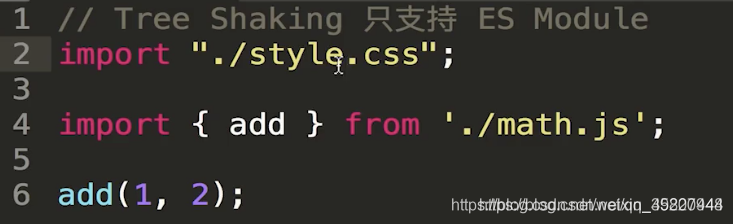
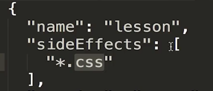
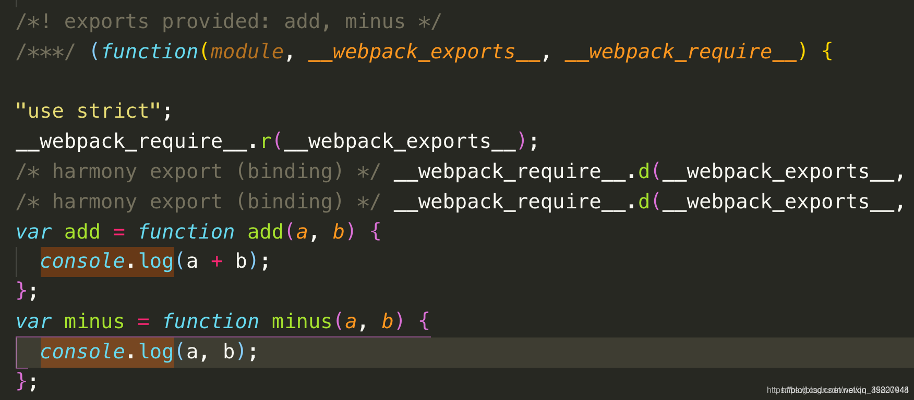

# Tree_Shaking

这篇文章写于两年前，前端的发展日新月异，新的构建工具已经开始崭露头角。Vite已经出来很久了，新版本也比较稳定，推荐大家学习这一款构建工具。

Tree Shaking 指的就是当我引入一个模块的时候，我不引入这个模块的所有代码，我只引入我需要的代码，这就需要借助 webpack 里面自带的 Tree Shaking 这个功能来帮我们实现。


官方有标准的说法：Tree-shaking的本质是消除无用的js代码。无用代码消除在广泛存在于传统的编程语言编译器中，编译器可以判断出某些代码根本不影响输出，然后消除这些代码，这个称之为DCE（dead code elimination）

在 webpack 项目中，有一个入口文件，相当于一棵树的主干，入口文件有很多依赖的模块，相当于树枝。实际情况中，虽然依赖了某个模块，但其实只使用其中的某些功能。通过 Tree-Shaking，将没有使用的模块摇掉，这样来达到删除无用代码的目的。


在production 模式下不用在webpack.config.js中配置

```
optimization: {
  usedExports: true
}
```


当在development模式下配置tree shaking时：

 webpack.config.js

    //HtmlWebpackPlugin
    //当我们整个打包过程结束的时候，自动生成一个html文件，
    //并把打包生成的自动引入到html这个文件中；
    
    var HtmlWebpackPlugin = require('html-webpack-plugin')
    const path = require('path')
    const { CleanWebpackPlugin } = require('clean-webpack-plugin')
    const webpack = require('webpack')
    module.exports = {
        //打包模式，当为‘production’，打包后的文件会被压缩，
        //当为‘development’时打包后的文件不会被压缩,按照开发环境进行打包
        mode: 'development', //在开发者模式中SourceMap默认已经被配置在项目里了。
        // devtool: 'none', //关闭SourceMap
        //cheap：在生成SourceMap的时候，可以不带列信息，只带行信息,不要包含loader里面的SourceMap的生成，
        //只对业务代码进行SourceMap的生成
        //module:对loader里面的代码也进行一个SourceMap的生成
        //eval：eval是一种执行方式
        devtool: 'cheap-module-eval-source-map', //打开SourceMap
        // devtool: 'cheap-module-source-map', //要线上的代码可以映射
        // 打包的入口文件
        entry: './src/index2.js',
        // entry: {
        //     main: './src/index2.js'
        // },
        devServer: {
            contentBase: './dist', //我们要在哪一个目录下去启动这个服务器
            open: true, //会自动的打开一个浏览器，然后自动访问服务器的地址（localhost:8080）
            hot: true, //指是否支持热更新（hmr）
            hotOnly: true, //即使不支持hmr或者hmr有问题,也不刷新浏览器
            proxy: {
                '/api': {
                    //当访问localhost:8080/api的时，它会直接帮你转发到http://localhost:3000
                    target: 'http://localhost:3000',
                    pathRewrite: { '^/api': '' }
                }
            }
        },
        module: {
            rules: [{
                    test: /\.js$/,
                    exclude: /node_modules/,
                    loader: 'babel-loader'
                },
                {
                    test: /\.(png|jpg|gif)$/,
                    use: {
                        loader: 'url-loader',
                        options: {
                            //url-loader会把图片转化成一个base64的字符串，
                            //然后直接放到bundle.js里，而不是单独生成一个图片文件，
                            //好处：不用再额外的请求图片的地址，省了一次http请求；
                            //缺点：如果图片特别大过大，打包生成的js文件就会很大，
                            //那么加载js文件的时间就会很长，所以在一开始很长的时间里，页面上什么都显示不出来；
                            //所以，url-loader最佳的使用方式：加一个limit
                            //如果图片小于limit的值就把图片变为一个base64的字符串放到打包好的js中，
                            //若大于limit的值，就以file-loader的生成一个图片放到dist目录下。
                            limit: 8192, //好处是可以对小图片的http请求数减少，提升网页加载数度
                            name: 'images/[name].[hash].[ext]'
                        }
                    }
                },
                {
                    test: /\.(css|scss|less)$/,
                //"css-loader":会帮我们分析出几个css文件之间的关系，最终把这些css文件合并成一段css;
                //"style-loader":会把‘css-loader’生成的内容挂在到页面的head部分
                //在webpack的配置中，loader是有先后执行顺序的，
                //loader的执行顺序是从下到上，从右到左；
                //“sass-loader”会先对sass代码进行翻译，翻译为css代码后给到css-loader,
                //都处理好了之后再交给‘style-loader’挂在到页面上
                //postcss-loader会自动添加css3的厂商前缀；比如：  transform: translate(100px, 100px)
                use: [
                    'style-loader',
                    {
                        loader: 'css-loader',
                        options: {
                            importLoaders: 2,
                            modules: true //使得css模块化，
                        }
                    },
                    'postcss-loader',
                    'sass-loader'
                ]
            },
            {
                // 可以打包字体文件
                test: /\.(eot|ttf|svg)$/,
                use: {
                    loader: 'file-loader'
                }
            }
        ]
    },
     
    // 打包的出口文件
    output: {
        // 打包后的文件名
        // filename: 'bundle.js',
        filename: '[name].js', //name就是entry值的key:'main','sub'
        // 打包后的文件目录为'dist'
        path: path.resolve(__dirname, 'dist'),
        publicPath: '/' //表示的是我所有的打包生成的文件之间的引用前面都加一个根路径
    },
    //plugin可以在webpack运行到某个时刻的时候，帮你做一些事情(类似生命周期函数)
    plugins: [
        // CleanWebpackPlugin可以在每次打包的时候帮我们对dist目录做一个清空
        new CleanWebpackPlugin(),
        new HtmlWebpackPlugin({
            //HtmlWebpackPlugin帮我们自动的生成一个dist目录下的html文件
            template: './src/index.html'
        }),
        //HotModuleReplacementPlugin帮我们实现HMR
        new webpack.HotModuleReplacementPlugin()
    ],
    //在开发模式下配置 tree shakeing
    optimization: {
        usedExports: true
    }
    }


在 package.json 中配置:

```
{
    "name": "webpack-demo",
//@babel/polyfill和css文件不使用tree shaking
    "sideEffects": [
        "@babel/polyfill",
        "*.css"
    ],
    "version": "1.0.0",
    "description": "",
    "main": "index.js",
    "scripts": {
        "bundle": "webpack",
        "watch": "webpack --watch",
        "start": "webpack-dev-server",
        "server": "node server.js"
    },
    "author": "susie",
    "license": "ISC",
    "devDependencies": {
        "@babel/core": "^7.5.4",
        "@babel/plugin-transform-runtime": "^7.5.0",
        "@babel/preset-env": "^7.5.4",
        "@babel/preset-react": "^7.0.0",
        "autoprefixer": "^9.6.1",
        "babel-loader": "^8.0.6",
        "clean-webpack-plugin": "^3.0.0",
        "css-loader": "^3.0.0",
        "file-loader": "^4.0.0",
        "html-webpack-plugin": "^3.2.0",
        "node-sass": "^4.12.0",
        "postcss-loader": "^3.0.0",
        "sass-loader": "^7.1.0",
        "style-loader": "^0.23.1",
        "url-loader": "^2.0.1",
        "webpack": "^4.35.3",
        "webpack-cli": "^3.3.5",
        "webpack-dev-server": "^3.7.2"
    },
    "dependencies": {
        "@babel/polyfill": "^7.4.4",
        "@babel/runtime": "^7.5.4",
        "@babel/runtime-corejs2": "^7.5.4",
        "react": "^16.8.6",
        "react-dom": "^16.8.6"
    }
}
```

要对某个模块不进行Tree Shaking

```
 "sideEffects": ["@babel/poly-fill"],  //该模块不进行Tree Shaking
```


为什么某些引入模块不希望进行Tree Shaking呢？

下面引入的style.css模块，如果也使用tree shaking，由于css文件没有导出任何模块，那么就有可能在打包的时候该引入模块就被摇晃掉了，导致bug。




在package.json中进行配置，即匹配到的任何css文件都不进行Tree Shaking




不使用Tree Shaking打包时，可以看到打包文件中exports provided: add, mins两种方法

